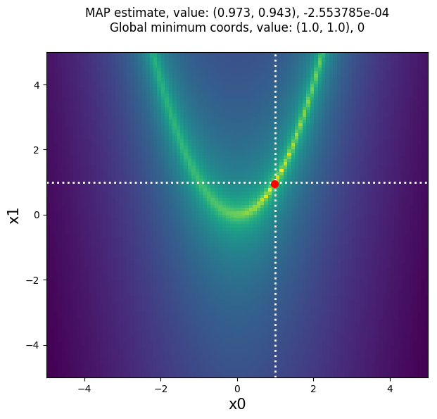

MAP Estimation
==============

Below is a quick example of how to use :py:obj:`approxposterior` to estimate the
maximum a posteriori (MAP) solution of the Rosenbrock Function example from Wang & Li (2017).

In this case, we are using the Rosenbrock function as our -loglikelihood function.
The MAP solution we find using :py:obj:`approxposterior` is therefore the minimum of the
Rosenbrock function. The 2D Rosenbrock function has a global minimum of 0 at (1,1),
so that what we hope to recover!

1) First, the user must set model parameters.

.. code-block:: python

  # Define algorithm parameters
  m0 = 50                           # Size of training set
  bounds = ((-5,5), (-5,5))         # Prior bounds
  algorithm = "bape"                # Use the Kandasamy et al. (2015) formalism
  seed = 57                         # RNG seed
  np.random.seed(seed)

2) Create an initial training set and gaussian process

.. code-block:: python

  # Sample design points from prior
  theta = lh.rosenbrockSample(m0)

  # Evaluate forward model log likelihood + lnprior for each point
  y = np.zeros(len(theta))
  for ii in range(len(theta)):
      y[ii] = lh.rosenbrockLnlike(theta[ii]) + lh.rosenbrockLnprior(theta[ii])

  # Initialize default gp with an ExpSquaredKernel
  gp = gpUtils.defaultGP(theta, y, white_noise=-10)

3) Initialize the :py:obj:`approxposterior` object and optimize GP hyperparameters

.. code-block:: python

  # Initialize object using the Wang & Li (2017) Rosenbrock function example
  ap = approx.ApproxPosterior(theta=theta,                     # Design points
                              y=y,                             # Logprobability of each input
                              gp=gp,                           # Initialize Gaussian Process
                              lnprior=lh.rosenbrockLnprior,    # logprior function
                              lnlike=lh.rosenbrockLnlike,      # loglikelihood function
                              priorSample=lh.rosenbrockSample, # Prior sample function
                              algorithm=algorithm,             # bape, agp, naive, or alternate
                              bounds=bounds)                   # Parameter bounds

  # Optimize the GP hyperparameters
  ap.optGP(seed=seed, method="powell", nGPRestarts=1)

4) Find MAP solution

.. code-block:: python

  # Find MAP solution and function value at MAP
  MAP, val = ap.findMAP(nRestarts=1)

5) Compare :py:obj:`approxposterior` MAP solution to truth: 0 at (1,1)

.. code-block:: python

  # Plot MAP solution on top of grid of Rosenbrock function evaluations
  import matplotlib.pyplot as plt

  fig, ax = plt.subplots(figsize=(7,6))

  # Generate grid of function values the old fashioned way because this function
  # is not vectorized...
  arr = np.linspace(-5, 5, 100)
  rosen = np.zeros((100,100))
  for ii in range(100):
      for jj in range(100):
          rosen[ii,jj] = lh.rosenbrockLnlike([arr[ii], arr[jj]])

  # Plot Rosenbrock function (rescale because it varies by several orders of magnitude)
  ax.imshow(-np.log(-rosen).T, origin="lower", aspect="auto", interpolation="nearest",
            extent=[-5, 5, -5, 5], zorder=0)

  # Plot truth
  ax.axhline(1, lw=2, ls=":", color="white", zorder=1)
  ax.axvline(1, lw=2, ls=":", color="white", zorder=1)

  # Plot MAP solution
  ax.scatter(MAP[0], MAP[1], color="red", s=50, zorder=2)

  # Format figure
  ax.set_xlabel("x0", fontsize=15)
  ax.set_ylabel("x1", fontsize=15)
  title = "MAP estimate, value: (%0.3lf, %0.3lf), %e\n" % (MAP[0], MAP[1], val)
  title += "Global minimum coords, value: (%0.1lf, %0.1lf), %d\n" % (1.0, 1.0, 0)
  ax.set_title(title, fontsize=12)

  # Save figure
  fig.savefig("rosenbrockMAP.png", bbox_inches="tight")

:py:obj:`approxposterior` MAP solution: (0.973, 0.943), -2.553785e-4.
Pretty close to the truth, and better yet, only 50 Rosenbrock function
evaluations were used to train the :py:obj:`approxposterior` GP used to estimate
the MAP solution. For computationally-expensive forward models, this method can
be used for efficient approximate Bayesian optimization of functions.
