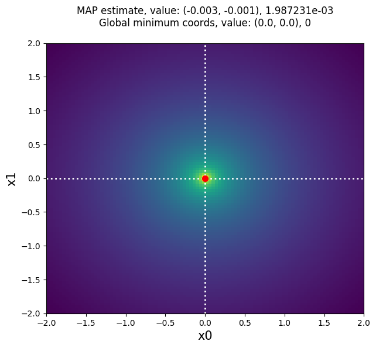

MAP Estimation
==============

:py:obj:`approxposterior` can be used to find an accurate approximation of the
maximum (or minimum) of a function by estimating the maximum a
posteriori (MAP) solution for the objective function. To find the MAP, we directly
maximize the GP surrogate model's posterior function, that is, the approximation
to the objective function learned by the GP after conditioning on observations. By design,
:py:obj:`approxposterior` trains its Gaussian process (GP) on a small number of
objective function evaluations. This method is therefore particularly useful
when the objective function is computationally-expensive to evaluate.

Below is a quick example of how to use :py:obj:`approxposterior` to estimate the
MAP solution of a simple 2D Gaussian.

In this case, we are using the -loglikelihood function of a 2D Gaussian with a mean
vector of 0 and the identity matrix as the covariance matrix. The MAP solution
we find using :py:obj:`approxposterior` is therefore the minimum. We hope to
recover the global minimum of 0 at (0,0), but only using 10 randomly sampled
points to make our training set for the GP.

1) First, the user must set model parameters.

.. code-block:: python

  from approxposterior import approx, gpUtils, likelihood as lh, utility as ut
  import numpy as np

  # Define algorithm parameters
  m0 = 10                           # Size of training set
  bounds = ((-5,5), (-5,5))         # Prior bounds
  algorithm = "bape"                # Use the Kandasamy et al. (2017) formalism
  seed = 57                         # RNG seed
  np.random.seed(seed)

2) Create an initial training set and Gaussian process

.. code-block:: python

  # Sample design points from prior
  theta = lh.sphereSample(m0)

  # Evaluate forward model log likelihood + lnprior for each point
  y = np.zeros(len(theta))
  for ii in range(len(theta)):
      y[ii] = lh.sphereLnlike(theta[ii]) + lh.sphereLnprior(theta[ii])

  # Initialize default gp with an ExpSquaredKernel
  gp = gpUtils.defaultGP(theta, y, white_noise=-12, fitAmp=True)

3) Initialize the :py:obj:`approxposterior` object and optimize GP hyperparameters

.. code-block:: python

  # Initialize approxposterior object
  ap = approx.ApproxPosterior(theta=theta,
                              y=y,
                              gp=gp,
                              lnprior=lh.sphereLnprior,
                              lnlike=lh.sphereLnlike,
                              priorSample=lh.sphereSample,
                              bounds=bounds,
                              algorithm=algorithm)

  # Optimize the GP hyperparameters
  ap.optGP(seed=seed, method="powell", nGPRestarts=1)

4) Find MAP solution

.. code-block:: python

  # Find MAP solution and function value at MAP
  MAP, val = ap.findMAP(nRestarts=5)

5) Compare :py:obj:`approxposterior` MAP solution to truth: 0 at (0,0)

.. code-block:: python

  # Plot MAP solution on top of grid of objective function evaluations
  import matplotlib.pyplot as plt

  fig, ax = plt.subplots(figsize=(7,6))

  # Generate grid of function values the old fashioned way because this function
  # is not vectorized...
  arr = np.linspace(-2, 2, 100)
  sphere = np.zeros((100,100))
  for ii in range(100):
      for jj in range(100):
          sphere[ii,jj] = lh.sphereLnlike([arr[ii], arr[jj]])

  # Plot objective function (rescale because it varies by several orders of magnitude)
  ax.imshow(np.log(-sphere).T, origin="lower", aspect="auto", interpolation="nearest",
            extent=[-2, 2, -2, 2], zorder=0, cmap="viridis_r")

  # Plot truth
  ax.axhline(0, lw=2, ls=":", color="white", zorder=1)
  ax.axvline(0, lw=2, ls=":", color="white", zorder=1)

  # Plot MAP solution
  ax.scatter(MAP[0], MAP[1], color="red", s=50, zorder=2)

  # Format figure
  ax.set_xlabel("x0", fontsize=15)
  ax.set_ylabel("x1", fontsize=15)
  title = "MAP estimate, value: (%0.3lf, %0.3lf), %e\n" % (MAP[0], MAP[1], val)
  title += "Global minimum coords, value: (%0.1lf, %0.1lf), %d\n" % (0.0, 0.0, 0)
  ax.set_title(title, fontsize=12)

  # Save figure
  fig.savefig("map.png", bbox_inches="tight")

:py:obj:`approxposterior` MAP solution: (-0.003 -0.001), 0.00198723 (red point),
compared to the truth (0,0), 0 (white dashed lines).
Our answer is pretty close to the truth, and better yet, :py:obj:`approxposterior`
only required 10 randomly-distributed objective function evaluations to train
its GP used to estimate the MAP solution. For computationally-expensive
forward models, this method can be used for efficient (approximate) Bayesian
optimization of functions. Better yet, MAP estimation can be ran after intelligently
expanding the GP's training set with the run or bayesOpt methods, or after calling
findNewPoint! See the detailed API for how to use those functions.
