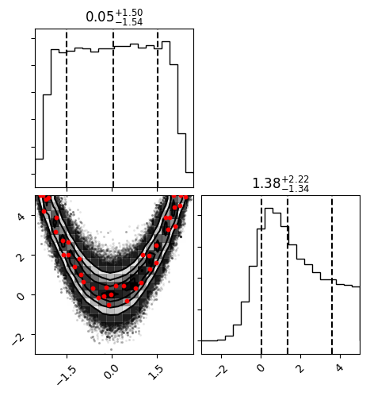

Tutorial
========

Below is a quick example of how to use :py:obj:`approxposterior` to compute the posterior
distribution of the Rosenbrock Function example from Wang & Li (2017) using the
BAPE algorithm. Note that setting verbose = True also outputs additional diagnostic information, such as when
the MCMC finishes, what the estimated burn-in is, and other quantities that are useful for tracking the progress of
your code.  In this example, we set verbose = False for simplicity.

Don't forget to check out the links for example Jupyter Notebooks at the bottom of the page!

1) First, the user must set model parameters.

.. code-block:: python

  # Define algorithm parameters
  m0 = 50                           # Initial size of training set
  m = 20                            # Number of new points to find each iteration
  nmax = 2                          # Maximum number of iterations
  bounds = ((-5,5), (-5,5))         # Prior bounds
  algorithm = "BAPE"                # Use the Kandasamy et al. (2015) formalism

  # emcee MCMC parameters
  samplerKwargs = {"nwalkers" : 20}        # emcee.EnsembleSampler parameters
  mcmcKwargs = {"iterations" : int(2.0e4)} # emcee.EnsembleSampler.run_mcmc parameters

2) Create an initial training set and gaussian process

.. code-block:: python

  # Sample initial conditions from the prior
  theta = lh.rosenbrockSample(m0)

  # Evaluate forward model log likelihood + lnprior for each theta
  y = np.zeros(len(theta))
  for ii in range(len(theta)):
      y[ii] = lh.rosenbrockLnlike(theta[ii]) + lh.rosenbrockLnprior(theta[ii])

  # Create the the default GP which uses an ExpSquaredKernel
  gp = gpUtils.defaultGP(theta, y, order=1, white_noise=-1)

3) Initialize the :py:obj:`approxposterior` object.

.. code-block:: python

  # Initialize object using the Wang & Li (2017) Rosenbrock function example
  ap = approx.ApproxPosterior(theta=theta,                     # Initial model parameters for inputs
                              y=y,                             # Logprobability of each input
                              gp=gp,                           # Initialize Gaussian Process
                              lnprior=lh.rosenbrockLnprior,    # logprior function
                              lnlike=lh.rosenbrockLnlike,      # loglikelihood function
                              priorSample=lh.rosenbrockSample, # Prior sample function
                              algorithm=algorithm,             # BAPE, AGP, or ALTERNATE
                              bounds=bounds)                   # Parameter bounds

4) Run!

.. code-block:: python

  # Run!
  ap.run(m=m, nmax=nmax, estBurnin=True, nGPRestarts=1, mcmcKwargs=mcmcKwargs,
         cache=False, samplerKwargs=samplerKwargs, verbose=True, onlyLastMCMC=True)

5) Examine the final posterior distributions!

.. code-block:: python

  # Check out the final posterior distribution!
  import corner

  # Load in chain from last iteration
  samples = ap.sampler.get_chain(discard=ap.iburns[-1], flat=True, thin=ap.ithins[-1])

  # Corner plot!
  fig = corner.corner(samples, quantiles=[0.16, 0.5, 0.84], show_titles=True,
                      scale_hist=True, plot_contours=True)

  fig.savefig("finalPosterior.png", bbox_inches="tight")

The final posterior distribution will look something like the following:

Check out the example notebooks to see example use cases, how the code runtime scales
for different forward model evaluation times, how we compute the Kullback–Leibler (KL) divergence,
and more.

  .. toctree::
     :maxdepth: 1
     :caption: Jupyter Notebook Examples:

     Example <notebooks/example.ipynb>
     Fitting a Line <notebooks/fittingALine.ipynb>
     Scaling and Accuracy <notebooks/ScalingAccuracy.ipynb>
     KL Divergence Estimation <notebooks/KLDivergenceEstimation.ipynb>
     Posterior Fitting with Gaussian Mixture Models <notebooks/posteriorFittingWithGMM.ipynb>
     Rosenbrock Function Example <notebooks/TrueRosenbrockPosterior.ipynb>
